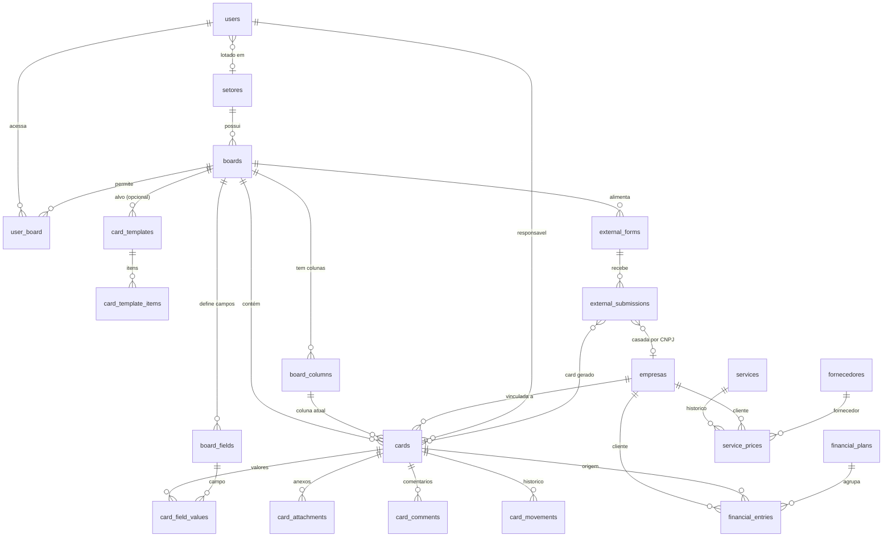

# 03 — Modelo de Dados

> **Modelo recomendado:** `sonnet` (Sonnet 5).

Fonte da verdade do schema MySQL (`upmusic_local`). O banco **já existe e está vazio** — criar tudo
via migrations Laravel. Nomes de tabela/coluna em inglês plural; rótulos de UI em PT-BR.

Convenções: toda tabela tem `id` (BIGINT UNSIGNED, auto), `created_at`, `updated_at`. Soft delete
(`deleted_at`) nas entidades de cadastro (users, setores, empresas, fornecedores, boards, cards,
services). FKs sempre indexadas com constraint. Dinheiro em `DECIMAL(15,2)`.

## 1. Diagrama de relacionamentos (ERD)



## 2. Ordem de criação (dependências)

Respeitar esta ordem em migrations e nos fluxos de criação da UI:

```
users → setores → (users.setor_id) 
empresas
fornecedores
boards (→ setores) → board_columns → board_fields → user_board
cards (→ boards, board_columns, empresas, users) → card_field_values, card_attachments, card_comments, card_movements
card_templates → card_template_items
financial_plans → financial_entries (→ empresas, cards)
services → service_prices (→ empresas, fornecedores, cards)
external_forms (→ boards) → external_submissions (→ empresas, cards)
```

## 3. Tabelas

### 3.1 users
Autenticação e perfil. Base do Breeze estendida.

| Coluna | Tipo | Regras |
|--------|------|--------|
| id | bigint PK | |
| name | varchar(150) | obrigatório |
| email | varchar(150) | único |
| password | varchar | hash |
| role | enum(`admin`,`coordenador`,`usuario`) | default `usuario` |
| setor_id | bigint FK→setores | nullable, `onDelete set null` |
| phone | varchar(20) | nullable |
| avatar_path | varchar | nullable |
| active | boolean | default true |
| email_verified_at, remember_token, timestamps, deleted_at | | |

Índices: `email` (unique), `role`, `setor_id`.

### 3.2 setores (departamentos)
Cadastro base de setores/departamentos da empresa.

| Coluna | Tipo | Regras |
|--------|------|--------|
| id | bigint PK | |
| nome | varchar(120) | obrigatório, único |
| descricao | text | nullable |
| color | varchar(7) | hex, default `#000000` |
| icon | varchar(40) | classe Font Awesome, nullable |
| active | boolean | default true |
| timestamps, deleted_at | | |

### 3.3 empresas (clientes)
Empresas vinculáveis aos cards e ao financeiro/preços.

| Coluna | Tipo | Regras |
|--------|------|--------|
| id | bigint PK | |
| corporate_name | varchar(180) | razão social, obrigatório |
| trade_name | varchar(180) | nome fantasia, nullable |
| cnpj | varchar(18) | único, formatado ou só dígitos (validar) |
| email | varchar(150) | nullable |
| phone | varchar(20) | nullable |
| zipcode, address, number, complement, district, city, state | varchar | nullable |
| notes | text | nullable |
| active | boolean | default true |
| timestamps, deleted_at | | |

Índices: `cnpj` (unique), `corporate_name`, `active`.

### 3.4 fornecedores
Fornecedores classificados por tipo PF/PJ.

| Coluna | Tipo | Regras |
|--------|------|--------|
| id | bigint PK | |
| type | enum(`PF`,`PJ`) | obrigatório |
| name | varchar(180) | nome (PF) ou razão social (PJ), obrigatório |
| document | varchar(18) | CPF (PF) ou CNPJ (PJ), único, validar por tipo |
| email | varchar(150) | nullable |
| phone | varchar(20) | nullable |
| category | varchar(80) | ex.: limpeza, segurança, som, nullable |
| notes | text | nullable |
| active | boolean | default true |
| timestamps, deleted_at | | |

Índices: `document` (unique), `type`, `active`.

### 3.5 boards (quadros / departamentos)
Cada quadro representa um departamento. Ver [06](06-quadros-e-departamentos.md).

| Coluna | Tipo | Regras |
|--------|------|--------|
| id | bigint PK | |
| setor_id | bigint FK→setores | nullable, `set null` |
| name | varchar(120) | obrigatório |
| description | text | nullable |
| color | varchar(7) | hex, default `#ff8c1e` |
| icon | varchar(40) | classe Font Awesome, nullable |
| position | int | ordenação no menu, default 0 |
| active | boolean | default true |
| timestamps, deleted_at | | |

### 3.6 board_columns (colunas / etapas / fases)

| Coluna | Tipo | Regras |
|--------|------|--------|
| id | bigint PK | |
| board_id | bigint FK→boards | `cascade` |
| name | varchar(120) | obrigatório |
| color | varchar(7) | hex, nullable |
| position | int | ordem, default 0 |
| is_final | boolean | default false — na última coluna aparece o botão de envio para outro quadro |
| is_entry | boolean | default false — coluna que recebe cards do formulário externo |
| timestamps | | |

Índices: `(board_id, position)`.

### 3.7 board_fields (campos configuráveis do card — estilo Pipefy)

| Coluna | Tipo | Regras |
|--------|------|--------|
| id | bigint PK | |
| board_id | bigint FK→boards | `cascade` |
| label | varchar(120) | obrigatório |
| type | enum(`text`,`textarea`,`number`,`money`,`date`,`select`,`checkbox`,`email`,`phone`,`file`) | |
| options | json | opções para `select`, nullable |
| required | boolean | default false |
| position | int | ordem, default 0 |
| timestamps | | |

### 3.8 cards

| Coluna | Tipo | Regras |
|--------|------|--------|
| id | bigint PK | |
| board_id | bigint FK→boards | `cascade` |
| board_column_id | bigint FK→board_columns | `restrict` |
| empresa_id | bigint FK→empresas | nullable, `set null` |
| assignee_id | bigint FK→users | nullable (responsável), `set null` |
| created_by | bigint FK→users | `set null` |
| title | varchar(180) | obrigatório |
| description | text | nullable |
| estimated_value | decimal(15,2) | previsto, nullable |
| actual_value | decimal(15,2) | realizado, nullable |
| due_date | date | prazo, nullable |
| priority | enum(`baixa`,`media`,`alta`) | default `media` |
| origin | enum(`manual`,`template`,`external_form`) | default `manual` |
| position | int | ordem dentro da coluna, default 0 |
| timestamps, deleted_at | | |

Índices: `(board_id, board_column_id, position)`, `empresa_id`, `assignee_id`.

### 3.9 card_field_values

| Coluna | Tipo | Regras |
|--------|------|--------|
| id | bigint PK | |
| card_id | bigint FK→cards | `cascade` |
| board_field_id | bigint FK→board_fields | `cascade` |
| value | text | nullable (arquivos guardam o path) |
| timestamps | | |

Único: `(card_id, board_field_id)`.

### 3.10 card_attachments
Anexos gerais, notas fiscais e fotos de comprovação.

| Coluna | Tipo | Regras |
|--------|------|--------|
| id | bigint PK | |
| card_id | bigint FK→cards | `cascade` |
| uploaded_by | bigint FK→users | `set null`, nullable |
| kind | enum(`geral`,`nota_fiscal`,`comprovante`) | default `geral` |
| original_name | varchar(255) | |
| path | varchar(255) | caminho no storage |
| mime | varchar(120) | |
| size | int | bytes |
| timestamps | | |

### 3.11 card_comments

| Coluna | Tipo | Regras |
|--------|------|--------|
| id | bigint PK | |
| card_id | bigint FK→cards | `cascade` |
| user_id | bigint FK→users | `set null` |
| body | text | obrigatório |
| timestamps | | |

### 3.12 card_movements (histórico/auditoria de transições)

| Coluna | Tipo | Regras |
|--------|------|--------|
| id | bigint PK | |
| card_id | bigint FK→cards | `cascade` |
| user_id | bigint FK→users | `set null` |
| from_board_id | bigint FK→boards | nullable |
| to_board_id | bigint FK→boards | nullable |
| from_column_id | bigint FK→board_columns | nullable |
| to_column_id | bigint FK→board_columns | nullable |
| type | enum(`column`,`board`) | movimento entre colunas ou entre quadros |
| timestamps | | |

### 3.13 user_board (pivot de acesso)
Define a quais quadros um usuário perfil `usuario` tem acesso.

| Coluna | Tipo |
|--------|------|
| user_id | bigint FK→users `cascade` |
| board_id | bigint FK→boards `cascade` |
| PK composta (user_id, board_id) | |

### 3.14 card_templates + card_template_items
Ver [08](08-templates-de-cards.md).

**card_templates**

| Coluna | Tipo | Regras |
|--------|------|--------|
| id | bigint PK | |
| name | varchar(120) | obrigatório |
| description | text | nullable |
| board_id | bigint FK→boards | nullable (quadro-alvo sugerido), `set null` |
| active | boolean | default true |
| timestamps, deleted_at | | |

**card_template_items**

| Coluna | Tipo | Regras |
|--------|------|--------|
| id | bigint PK | |
| card_template_id | bigint FK→card_templates | `cascade` |
| title | varchar(180) | obrigatório |
| description | text | nullable |
| default_column_id | bigint FK→board_columns | nullable, `set null` |
| default_fields | json | valores pré-preenchidos de campos, nullable |
| position | int | default 0 |
| timestamps | | |

### 3.15 financial_plans + financial_entries
Ver [09](09-planejamento-financeiro.md).

**financial_plans**

| Coluna | Tipo | Regras |
|--------|------|--------|
| id | bigint PK | |
| name | varchar(120) | ex.: "Evento X 2026", obrigatório |
| empresa_id | bigint FK→empresas | nullable, `set null` |
| period_year | smallint | nullable |
| period_month | tinyint | nullable (1–12) |
| notes | text | nullable |
| timestamps, deleted_at | | |

**financial_entries**

| Coluna | Tipo | Regras |
|--------|------|--------|
| id | bigint PK | |
| financial_plan_id | bigint FK→financial_plans | nullable, `cascade` |
| card_id | bigint FK→cards | nullable, `set null` (origem) |
| empresa_id | bigint FK→empresas | nullable, `set null` |
| description | varchar(180) | obrigatório |
| category | varchar(80) | nullable |
| estimated_value | decimal(15,2) | previsto, default 0 |
| actual_value | decimal(15,2) | realizado, default 0 |
| estimated_date | date | nullable |
| actual_date | date | nullable |
| timestamps | | |

Índices: `financial_plan_id`, `empresa_id`, `card_id`.

### 3.16 services + service_prices
Ver [10](10-banco-de-precos.md).

**services**

| Coluna | Tipo | Regras |
|--------|------|--------|
| id | bigint PK | |
| name | varchar(150) | obrigatório |
| description | text | nullable |
| category | varchar(80) | nullable |
| unit | varchar(30) | ex.: diária, unidade, hora, nullable |
| active | boolean | default true |
| timestamps, deleted_at | | |

**service_prices** (histórico)

| Coluna | Tipo | Regras |
|--------|------|--------|
| id | bigint PK | |
| service_id | bigint FK→services | `cascade` |
| empresa_id | bigint FK→empresas | nullable (cliente), `set null` |
| fornecedor_id | bigint FK→fornecedores | nullable, `set null` |
| card_id | bigint FK→cards | nullable (origem), `set null` |
| price | decimal(15,2) | obrigatório |
| reference_date | date | obrigatório |
| notes | varchar(255) | nullable |
| created_by | bigint FK→users | `set null` |
| timestamps | | |

Índices: `(service_id, empresa_id, reference_date)` para evolução histórica por cliente.

### 3.17 external_forms + external_submissions
Ver [11](11-formulario-externo.md).

**external_forms**

| Coluna | Tipo | Regras |
|--------|------|--------|
| id | bigint PK | |
| board_id | bigint FK→boards | quadro-alvo, `cascade` |
| target_column_id | bigint FK→board_columns | coluna de análise, `set null`, nullable |
| token | varchar(40) | único, usado na URL pública |
| title | varchar(150) | título exibido, nullable |
| active | boolean | default true |
| timestamps | | |

**external_submissions**

| Coluna | Tipo | Regras |
|--------|------|--------|
| id | bigint PK | |
| external_form_id | bigint FK→external_forms | `cascade` |
| empresa_id | bigint FK→empresas | nullable (casada por CNPJ), `set null` |
| card_id | bigint FK→cards | nullable (card gerado), `set null` |
| cnpj | varchar(18) | obrigatório |
| name | varchar(180) | obrigatório |
| value | decimal(15,2) | obrigatório |
| service_date | date | obrigatório |
| service_description | text | obrigatório |
| invoice_path | varchar(255) | anexo da NF, obrigatório |
| status | enum(`recebido`,`processado`,`descartado`) | default `recebido` |
| ip | varchar(45) | nullable |
| timestamps | | |

## 4. Notas de integridade

- Excluir um **board** faz cascade em columns, fields, cards (e dependências dos cards). Como cadastros
  usam soft delete, "excluir" na UI é soft delete; exclusão física fica restrita ao Admin.
- Mover card entre quadros: `cards.board_id` e `board_column_id` mudam e grava-se `card_movements` (type `board`).
- `external_submissions` casa `cnpj` com `empresas.cnpj`; se não existir empresa, o card é criado sem
  vínculo e o Admin pode cadastrar/associar depois.
- Validar CPF/CNPJ conforme `fornecedores.type` e `empresas.cnpj` (helpers em `app/Support`).

## 5. Seeders

- `RoleUserSeeder`: 1 admin (`admin@upmusic.local`), 1 coordenador, 1 usuário.
- `SetorSeeder`: Orçamentos, Jurídico, Financeiro, Conclusão.
- `BoardSeeder`: um quadro por setor com colunas do [fluxo de processos](12-fluxo-de-processos.md) e `is_final`/`is_entry` marcados.
- Seeders de exemplo (empresas, fornecedores, serviços) para demonstração — sem emojis.
