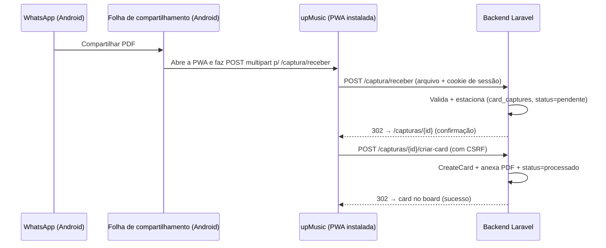
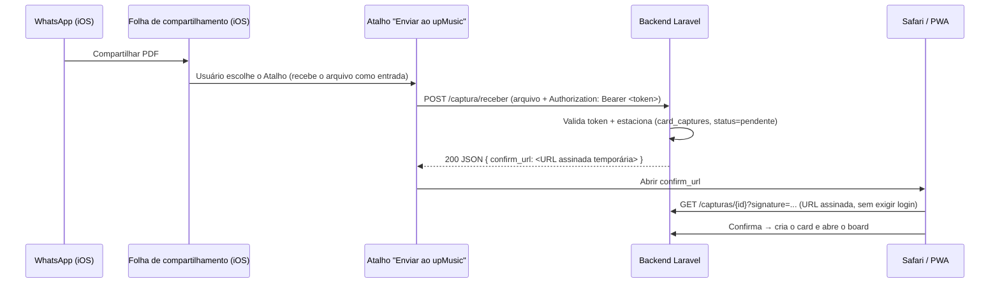

# 16 — Captura Rápida de Orçamentos e NFs (WhatsApp → Card, custo zero)

> **Modelo recomendado:** `opus` (Opus 4.8) — envolve PWA/Service Worker, Web Share Target e um novo
> fluxo de ingestão. A parte de backend (Action + tabela) é reuso direto do padrão do formulário externo.

> **Status:** especificação aprovada para planejamento. Substitui, na prática, a
> [Integração com WhatsApp (spec 13)](13-integracao-whatsapp.md) como caminho **de custo zero** para o
> MVP — ver [§3](#3-premissas-e-restrições) e [§17](#17-relação-com-outras-specs).

---

## Recomendação do tech lead (TL;DR)

**Entregar em 3 passos, nesta ordem — cada um gera valor sozinho:**

1. **Passo 1 — Tela "Captura Rápida" in-app (Canal B).** Serve **iPhone e Android desde já, sem instalar
   nada**: abre o upMusic → seleciona o PDF (o WhatsApp salva em Arquivos) → vira card com o anexo. Resolve
   o cerne do problema ("sem salvar no computador, sem criar card manual") para **todos**. **Fazer primeiro
   e isolado.**
2. **Passo 2 — Android: compartilhar direto do WhatsApp (PWA + Web Share Target).** O upMusic aparece na
   folha de compartilhamento do Android. Custo zero.
3. **Passo 3 — iPhone: compartilhar direto do WhatsApp (Atalho da Apple).** Um Atalho, instalado **uma vez
   por iPhone** (+ token), aparece na folha de compartilhamento do iOS.

**Verdade dura sobre o iPhone (para não repetir a dúvida):** uma **PWA adicionada à Tela de Início NUNCA
aparece no "Compartilhar" do iPhone** — a Apple não implementa Web Share Target no iOS; não há
configuração que resolva. O que aparece no Compartilhar do iPhone é **o Atalho** (item do app "Atalhos"),
**não** a PWA/site. Um ícone nativo de verdade no Compartilhar do iOS só com **app nativo (Apple Developer
US$99/ano)** — fora de escopo por decisão de custo. Logo: **iPhone → Atalho; Android → PWA; todos →
Captura Rápida in-app.**

---

## 1. Objetivo

Permitir que a equipe da Up Music transforme um **orçamento** ou **nota fiscal** recebido no WhatsApp em um
**card com o PDF anexado**, em poucos toques, sem precisar salvar o arquivo no computador, abrir o quadro,
criar o card manualmente e anexar. O objetivo é reduzir o fluxo atual de ~6 passos para **2 toques**, sem
introduzir nenhum custo de licença, API paga ou serviço externo.

## 2. Contexto e problema

Hoje há **alto volume** de orçamentos e NFs chegando por WhatsApp (mobile e WhatsApp Web). O fluxo atual é
manual e lento:

1. Abrir a conversa no WhatsApp.
2. Baixar/salvar o PDF no computador.
3. Abrir o sistema, achar o quadro certo.
4. Criar um card.
5. Abrir o card e anexar o arquivo.
6. Preencher dados.

São muitos passos para uma tarefa repetitiva e de alta frequência. O gargalo não é o cadastro em si (isso o
[formulário externo](11-formulario-externo.md) já resolve para o **cliente**), e sim a **ingestão rápida de
um arquivo que já está na mão do time interno**, dentro do WhatsApp.

> **Diferença crítica em relação à spec 11:** o formulário externo é preenchido **pelo cliente** (link
> público, sem login). A Captura Rápida é para o **time interno** (autenticado) dar entrada rápida em um PDF
> que ele já recebeu. São canais complementares que convergem no mesmo backend de criação de card.

## 3. Premissas e restrições

- **Custo adicional zero (restrição dura).** Nada de WhatsApp Business Cloud API (Meta cobra por
  conversa/janela de 24h) nem de agregadores pagos (Twilio, 360dialog, Z-API — assinatura/consumo). Isso
  **descarta a abordagem da spec 13** para o MVP.
- Só usar recursos **gratuitos**: **PWA (Web App Manifest + Service Worker)** e **Web Share Target API** no
  Android; **Atalhos da Apple** (app "Atalhos") + **tokens Sanctum** (já embutido no Laravel) no iOS. Nada
  de conta Apple Developer (US$99/ano), loja de apps ou SDK pago.
- Reaproveitar o backend existente: `CreateCard`, criação de anexo e o padrão do
  `ProcessExternalSubmission`.
- Sem dependências novas de infraestrutura paga. HTTPS já é requisito de produção (Let's Encrypt é
  gratuito) — ver [§10](#10-pwa-manifest-service-worker-e-ícones).
- Mobile-first, identidade Up Music (preto + `#ff8c1e`), Font Awesome, SweetAlert2, **sem emojis**.

## 4. Visão da solução

Um recurso chamado **"Captura Rápida"** com **dois canais de entrada** que convergem no mesmo backend
(mesmo endpoint de recebimento, mesma Action de criação de card):

### Canal A — Compartilhar do WhatsApp (aparece na folha de compartilhamento)
No WhatsApp: tocar no PDF → **Compartilhar** → escolher **upMusic** → cai numa tela de confirmação enxuta →
confirmar → card criado com o anexo. É o caminho que resolve o problema descrito. A **implementação difere
por plataforma** (limitação da Apple obriga isso), mas a experiência do usuário é equivalente e **ambas têm
custo zero**:

- **Android → PWA + Web Share Target API.** Com o upMusic instalado como PWA, ele aparece nativamente na
  folha de compartilhamento. Recurso padrão da web, gratuito. Autenticação pelo **cookie de sessão** (mesma
  origem). Ver [§5.1](#51-android--pwa--web-share-target).
- **iOS → Atalho da Apple (app "Atalhos").** O iOS/Safari **não suporta** Web Share Target, então uma PWA
  nunca apareceria na folha do iPhone. A via de custo zero é um **Atalho** distribuído ao time, com "Mostrar
  na Folha de Compartilhamento" ligado: ele recebe o PDF, envia ao upMusic (autenticado por **token
  pessoal**) e abre o board. Ver [§5.2](#52-ios--atalho-da-apple-shortcut).

### Canal B — Captura Rápida in-app (fallback universal)
Uma tela mobile-first dentro do app ("Novo a partir de anexo") com **arrastar/soltar ou selecionar
arquivo**. Funciona em **qualquer plataforma** (inclusive desktop/WhatsApp Web). Rede de segurança para quem
não instalou a PWA (Android) nem o Atalho (iOS).

Todos os canais **empilham** os arquivos numa **Caixa de Entrada de Capturas** (§8/§11), atendendo ao "alto
volume": dá para compartilhar vários PDFs em sequência e triá-los depois.

### Matriz de suporte por plataforma

| Plataforma | Canal A (compartilhar do WhatsApp) | Canal B (in-app) |
|---|---|---|
| Android + Chrome/Edge | Sim — PWA + Web Share Target (sessão) | Sim |
| iPhone / iPad (iOS) | Sim — Atalho da Apple (token) | Sim |
| Desktop (WhatsApp Web) | Parcial (Chrome desktop com PWA) | Sim |

> **Decisão de produto (aprovada):** iOS via **Atalho de custo zero** (não app nativo, que exigiria a conta
> Apple Developer de US$99/ano). O Atalho aparece na folha de compartilhamento e abre o board; em troca,
> exige instalar o Atalho **uma vez por iPhone** e tem visual de "atalho", não de app nativo. Se um dia se
> aceitar o custo recorrente da Apple, a evolução natural é um wrapper nativo (Capacitor) com *Share
> Extension* — fora de escopo aqui.

## 5. Como funciona o Canal A (compartilhar do WhatsApp)

### 5.1 Android — PWA + Web Share Target



Pontos-chave:
- O POST de `/captura/receber` é uma **navegação disparada pelo SO** (não por um form Blade), então **não
  carrega token CSRF**. A rota fica **isenta de CSRF** (como um webhook), protegida por **sessão
  autenticada** (o cookie vai por ser mesma origem) + **validação estrita de upload**. Só **estaciona** o
  arquivo — nada destrutivo.
- A criação do card (confirmação) é um **form Blade normal, com CSRF**.

### 5.2 iOS — Atalho da Apple (Shortcut)



Como o Atalho é montado (uma vez, distribuído ao time):
1. Ações do Atalho: **Receber** Arquivos/PDF/Imagens como entrada da Folha de Compartilhamento → **Obter
   Conteúdo do URL** (POST `multipart/form-data` para `/captura/receber`, campo `arquivos`, header
   `Authorization: Bearer <token pessoal>`) → **Abrir URLs** com o `confirm_url` devolvido.
2. "Mostrar na Folha de Compartilhamento" **ligado**, aceitando tipos PDF e Imagem. Assim o Atalho aparece
   na lista do "Compartilhar" do WhatsApp.
3. Distribuição: link do iCloud / arquivo `.shortcut` mais o **token pessoal** copiado da tela "Configurar
   iPhone" (§11). Setup único por aparelho.

Pontos-chave:
- O Atalho **não tem sessão de navegador**, então autentica por **token pessoal** (Sanctum — ver §9/§12). O
  mesmo endpoint `/captura/receber` aceita **token (iOS)** ou **sessão (Android)**.
- Como não há sessão, o passo "abrir o board" usa uma **URL assinada temporária** (`temporarySignedRoute`
  do Laravel) devolvida no JSON — abre a confirmação/board no Safari sem exigir novo login. Custo zero.
- A tela aberta pela URL assinada permite confirmar tipo/quadro e criar o card (ou, no modo "1 toque",
  o card já é criado com os defaults e a URL abre direto no board).

## 6. Escopo

### Fase 1 — Backend + Canal B (universal)
- Backend de ingestão (Action + tabela `card_captures` + enums) — [§8](#8-modelo-de-dados)/[§9](#9-backend).
- Canal B (Captura Rápida in-app) — funciona em todo aparelho, sem depender de PWA/Atalho.
- Caixa de Entrada de Capturas (triagem) — [§11](#11-telasux).

### Fase 2 — Canal A Android (PWA + Web Share Target)
- PWA instalável (manifest + service worker + ícones) — [§10](#10-pwa-manifest-service-worker-e-ícones).
- Endpoint `/captura/receber` aceitando a sessão (mesma origem).

### Fase 3 — Canal A iOS (Atalho da Apple)
- Autenticação por **token pessoal** (Sanctum) no `/captura/receber` + resposta com **URL assinada**.
- Tela "Configurar iPhone" (gerar/revogar token + instalar o Atalho) — [§11](#11-telasux).
- Montar e publicar o Atalho (link iCloud / `.shortcut`) e o passo a passo de instalação.

### Fora do MVP (fases futuras)
- App nativo (Capacitor) com *Share Extension* / intent — só se aceitarem o custo Apple (US$99/ano).
- Canal de e-mail (encaminhar o PDF do WhatsApp para um endereço monitorado via IMAP) — [§16](#16-fora-de-escopo).
- OCR/extração automática de CNPJ e valor do PDF.
- Casamento automático de empresa/fornecedor por conteúdo do documento.
- Notificação push (Web Push) quando uma captura fica pendente.

## 7. Requisitos funcionais

- **RF01** — Usuário autenticado consegue enviar um PDF/imagem ao sistema pelo compartilhamento nativo do
  WhatsApp (Canal A) **ou** pela tela de Captura Rápida (Canal B).
- **RF02** — Cada arquivo recebido vira uma **captura pendente** na Caixa de Entrada, vinculada ao usuário
  que capturou.
- **RF03** — Na confirmação, o usuário define **o mínimo**: tipo (Orçamento/NF) e quadro de destino. Título,
  empresa/fornecedor, evento e valor são **opcionais** (podem ser preenchidos depois no card).
- **RF04** — Ao confirmar, o sistema cria um card no quadro escolhido, na **coluna de entrada**
  (`is_entry`), com o arquivo anexado com o `kind` correto, e marca a captura como **processada**.
- **RF05** — O quadro de destino default é o **último usado** pelo usuário na captura (lembrado em sessão),
  acelerando envios repetidos.
- **RF06** — O usuário pode **descartar** uma captura pendente (remove o arquivo de staging).
- **RF07** — Suporte a **múltiplos arquivos** numa mesma captura (o Share Target e o seletor aceitam vários).
- **RF08** — Aceitar `application/pdf` e imagens (`jpg`, `jpeg`, `png`, `webp`); validar MIME e tamanho.
- **RF09** — A PWA é **instalável** e mantém a sessão viva o suficiente para o compartilhamento funcionar
  sem novo login frequente.

## 8. Modelo de dados

Nova tabela **`card_captures`** (staging das capturas até virarem card). Nomes em inglês no plural, padrão
Laravel — ver [03-modelo-de-dados.md](03-modelo-de-dados.md).

| Coluna | Tipo | Observação |
|---|---|---|
| `id` | bigint PK | |
| `user_id` | FK → `users` nullOnDelete | quem capturou |
| `board_id` | FK → `boards` nullable nullOnDelete | destino sugerido/escolhido |
| `card_id` | FK → `cards` nullable nullOnDelete | preenchido quando vira card |
| `kind` | varchar(20) default `'orcamento'` | `AttachmentKind` (orcamento/nota_fiscal/geral/comprovante) |
| `source` | varchar(20) default `'pwa_share'` | `pwa_share` (Android) \| `ios_shortcut` (iPhone) \| `upload` (Canal B) — métricas |
| `status` | varchar(20) default `'pendente'` | `pendente` \| `processado` \| `descartado` |
| `original_name` | varchar(255) | nome original do arquivo |
| `path` | varchar(255) | arquivo em staging no disco `local` |
| `mime` | varchar(120) nullable | |
| `size` | unsignedInteger default 0 | bytes |
| `suggested_title` | varchar(180) nullable | derivado do nome/params do share |
| `timestamps` | | |

- Armazenamento em staging: disco **`local`** (privado, `storage/app/...`), padrão
  `capturas/{user_id}/{uuid}.{ext}` — coerente com o disco usado pelos anexos hoje
  (`card-attachments/{card_id}` e `external-invoices/{form_id}`).
- Ao processar: mover o arquivo para `card-attachments/{card_id}/` e criar o registro em `card_attachments`,
  para que a exclusão do card limpe o arquivo (mesma convenção dos anexos atuais).

### Novos valores de enum (app layer)

- **`App\Domain\Enums\AttachmentKind`**: adicionar `Orcamento = 'orcamento'` (label "Orçamento"). Já
  existem `Geral`, `NotaFiscal`, `Comprovante`.
- **`App\Domain\Enums\CardOrigin`**: adicionar `CapturaRapida = 'captura_rapida'` (label "Captura rápida").
  Já existem `Manual`, `Template`, `ExternalForm`.

> Ambas as colunas de origem/kind já são `varchar(20)` no banco (`cards.origin`, `card_attachments.kind`),
> então **não há migration nova para os enums** — só a adição dos casos no enum PHP. A única migration nova
> é a de `card_captures`.

### Tokens do Atalho iOS (sem tabela nova)
Os tokens pessoais usam **Laravel Sanctum**, cuja tabela `personal_access_tokens` **já existe** (migration
padrão `2019_12_14_000001`). Cada usuário gera **um** token de captura (ability/scope `capture:create`) na
tela "Configurar iPhone" e cola no Atalho. Nada de tabela nova nem dependência paga.

## 9. Backend

### Action `App\Actions\Captures\ProcessQuickCapture`
Espelha o `ProcessExternalSubmission`, mas para uso interno autenticado (sem casar CNPJ, sem coletar dados
do cliente). Numa transação:

1. Resolve o quadro (`board_id`) e a coluna de entrada via a cadeia já existente do `CreateCard`:
   `board_column_id` explícito → coluna `is_entry` → menor `position`.
2. `CreateCard->execute($board, $data, $actor, CardOrigin::CapturaRapida)` com:
   - `title` = título informado, senão `suggested_title`, senão nome do arquivo sem extensão, senão
     `"Captura — {data}"`;
   - `empresa_id`/`fornecedor_id`/`event_id`/`estimated_value` = opcionais (se informados na confirmação);
   - `board_column_id` = coluna escolhida (ou default).
3. Move o arquivo de `capturas/...` para `card-attachments/{card_id}/` e cria o `card_attachments` com o
   `kind` (Orçamento ou Nota fiscal), `uploaded_by = actor->id`, `original_name`, `path`, `mime`, `size`.
4. Marca a `card_capture` como `processado` e vincula `card_id`.
5. Retorna o card criado.

> Reuso importante: `CreateCard` já dispara o `SyncCardPriceRecord` (banco de preços) e o preenchimento de
> `position`. A Action de captura **não deve duplicar** essa lógica — só orquestra.

### Controller `App\Http\Controllers\CaptureController`
- `receive(Request)` — recebe o POST do Canal A (multipart, sem CSRF). **Autenticação dupla**: token
  pessoal (`Authorization: Bearer`, iOS) **ou** sessão (mesma origem, Android). Valida upload, cria uma ou
  mais `card_captures` (`status=pendente`, `source=pwa_share` ou `ios_shortcut`). Resposta:
  - **Android (sessão)**: `302` para a confirmação (1 arquivo) ou Caixa de Entrada (vários).
  - **iOS (token)**: `200 JSON { confirm_url }`, onde `confirm_url` é uma **URL assinada temporária**
    (`URL::temporarySignedRoute('captures.show', now()->addMinutes(30), [...])`) — o Atalho a abre no
    Safari sem exigir login.
- `index()` — Caixa de Entrada (lista de capturas `pendente` do usuário).
- `show(CardCapture)` — tela de confirmação. Aceita **sessão** ou **assinatura válida** (`signed`
  middleware) — assim o link do Atalho abre sem sessão.
- `store(ConfirmCaptureRequest, CardCapture)` — chama `ProcessQuickCapture`, redireciona ao quadro/card.
- `upload(QuickUploadRequest)` — Canal B (seletor in-app): cria `card_capture` (`source=upload`) e vai para
  a confirmação.
- `destroy(CardCapture)` — descarta (apaga arquivo de staging + registro).

Validação sempre em **Form Requests** (`ConfirmCaptureRequest`, `QuickUploadRequest`), regras em Action —
padrão do projeto ([01-arquitetura-tecnica.md](01-arquitetura-tecnica.md)).

### Gestão do token iOS `App\Http\Controllers\CaptureTokenController` (sessão, autenticado)
- `store()` — gera (ou regenera) o token pessoal de captura do usuário via Sanctum
  (`$user->createToken('captura-ios', ['capture:create'])`), revogando o anterior. Retorna o texto puro
  **uma única vez** para copiar.
- `destroy()` — revoga o token de captura do usuário.
- O `receive()` exige a ability `capture:create` quando autenticado por token.

### Limpeza de staging
Comando agendado `captures:prune` (Laravel Scheduler + cron — infra já disponível, custo zero) remove
`card_captures` `pendente` com mais de **7 dias** e seus arquivos. Evita lixo de capturas abandonadas.

## 10. PWA: manifest, Service Worker e ícones (Canal A no Android)

> A PWA/Web Share Target vale **só para o Android**. No iOS o compartilhamento é feito pelo **Atalho**
> ([§5.2](#52-ios--atalho-da-apple-shortcut)) — a PWA no iPhone serve apenas como atalho de tela inicial,
> não recebe compartilhamento.

Requisitos para o Canal A no Android (tudo padrão da web, sem custo):

- **HTTPS obrigatório em produção** (PWA e Share Target só funcionam em origem segura). `localhost` é tratado
  como seguro em dev. Certificado gratuito (Let's Encrypt).
- **`public/manifest.webmanifest`** com `display: standalone`, cores da marca e o bloco `share_target`:

```json
{
  "name": "upMusic",
  "short_name": "upMusic",
  "start_url": "/dashboard",
  "display": "standalone",
  "background_color": "#000000",
  "theme_color": "#ff8c1e",
  "icons": [
    { "src": "/img/pwa-192.png", "sizes": "192x192", "type": "image/png", "purpose": "any maskable" },
    { "src": "/img/pwa-512.png", "sizes": "512x512", "type": "image/png", "purpose": "any maskable" }
  ],
  "share_target": {
    "action": "/captura/receber",
    "method": "POST",
    "enctype": "multipart/form-data",
    "params": {
      "title": "title",
      "text": "text",
      "files": [{ "name": "arquivos", "accept": ["application/pdf", "image/*"] }]
    }
  }
}
```

- **Service Worker** (`public/sw.js`) mínimo — necessário só para tornar a PWA instalável (app shell
  básico/offline fallback). O POST do Share Target vai direto ao backend (o SW não precisa interceptá-lo).
- **Ícones**: gerados a partir de `referencia/LOGO UP.png` sobre fundo sólido (preto), 192px e 512px,
  `maskable`, copiados para `public/img/`.
- Registrar o SW e linkar o manifest no layout autenticado (`layouts/app`).
- Banner/CTA discreto "Instalar app" (evento `beforeinstallprompt`) para estimular a instalação no Android.

## 11. Telas/UX

Mobile-first, identidade Up Music, Font Awesome, feedback com SweetAlert2, sem emojis.

1. **Tela de confirmação da captura** (`/capturas/{id}`) — o cerne da velocidade:
   - Prévia do arquivo (ícone de PDF + nome, ou miniatura da imagem).
   - **Tipo**: alternância Orçamento / Nota fiscal (default Orçamento — é a maior demanda).
   - **Quadro**: select dos quadros que o usuário acessa, default = último usado.
   - Opcionais recolhíveis: Título (pré-preenchido), Empresa/Fornecedor (busca), Evento, Valor (máscara BR).
   - Botão primário **"Criar card"** (laranja). Com o default de quadro, é **1 toque**.
2. **Caixa de Entrada de Capturas** (`/capturas`) — item no menu ("Captura rápida"):
   - Lista das capturas pendentes do usuário (arquivo, quando, origem Share/Upload).
   - Ações por item: "Criar card" (vai à confirmação) e "Descartar".
   - Estado vazio com instrução de como compartilhar do WhatsApp e como instalar o app.
3. **Captura Rápida in-app** (Canal B) — área de arrastar/soltar ou "Selecionar arquivo" (`accept`
   pdf/imagem, `multiple`), reutilizando o mesmo destino de confirmação.
4. **Configurar iPhone** (`/capturas/configurar-iphone`) — habilita o Canal A no iOS:
   - Botão "Gerar token" (mostra o token puro **uma vez**, com botão copiar via SweetAlert2) e "Revogar".
   - Botão/QR "Instalar Atalho" (link iCloud/`.shortcut`) e passo a passo curto (colar o token no Atalho,
     ligar "Mostrar na Folha de Compartilhamento").
   - Aviso de segurança: o token dá acesso de captura à conta; se trocar de aparelho, regenerar.
5. **Sucesso** — toast SweetAlert2 "Card criado" com link "Abrir card" (abre o card no quadro).
6. **Ponto de entrada**: item de menu "Captura rápida" e um botão flutuante (FAB) nas telas mobile;
   dentro dela, um link discreto "Configurar iPhone" e "Instalar app" (Android).

## 12. Segurança e limites

- **Autenticação**: todo o fluxo exige identidade. Android/Canal B → **sessão** (`auth`, `active`); iOS →
  **token pessoal Sanctum** com ability `capture:create`. O arquivo capturado pertence ao usuário.
- **CSRF**: `/captura/receber` é **isento de CSRF** (`VerifyCsrfToken::$except`), pois o POST vem do SO
  (Android) ou do Atalho (iOS), sem token CSRF. Compensações: exige sessão **ou** token válido, só
  **estaciona** arquivo (nada destrutivo) e valida upload rigorosamente. A criação do card (confirmação) usa
  **CSRF normal**.
- **Token iOS**: um por usuário (regenerar revoga o anterior), escopo mínimo (`capture:create`), revogável
  na tela "Configurar iPhone", mostrado em texto puro só na geração. Rate limiting no `/captura/receber`.
- **URL assinada (iOS)**: a confirmação aberta pelo Atalho usa `temporarySignedRoute` com validade curta
  (ex.: 30 min) e escopo à captura/usuário — abre sem sessão, mas não é reutilizável nem adivinhável.
- **Sessão/token ausente no share**: no Android, se a sessão expirou, o `auth` redireciona ao login e o
  arquivo se perde (mitigar com sessão longa/"lembrar-me"). No iOS, token inválido/revogado → o Atalho
  recebe `401` e mostra "reconfigure o token". (Limitações conhecidas — [§15](#15-riscos-e-limitações).)
- **Upload**: validar MIME e tamanho (mesmo teto dos anexos atuais, `max:10240` KB;
  `mimes:pdf,jpg,jpeg,png,webp`). Armazenar em disco `local` (privado).
- **Rate limiting** nas rotas de captura (`throttle`) para evitar abuso/loop de share.
- **Autorização**: o usuário só cria card em quadros a que tem acesso (Policies + verificação do
  `board_id` na confirmação).
- **Isolamento**: um usuário só vê/processa/descarta as **próprias** capturas pendentes.

## 13. Rotas

```
// Recebimento do Canal A — isenta de CSRF; aceita sessão (Android) OU token Sanctum (iOS)
POST   /captura/receber                 captures.receive

// Autenticadas por sessão (auth, active)
GET    /capturas                        captures.index                // Caixa de entrada
POST   /capturas/upload                 captures.upload               // Canal B (seletor in-app)
GET    /capturas/{capture}              captures.show                 // Confirmação (sessão OU URL assinada)
POST   /capturas/{capture}/criar-card   captures.store                // Cria o card (CSRF)
DELETE /capturas/{capture}              captures.destroy              // Descartar
GET    /capturas/configurar-iphone      captures.ios.setup            // Token + instalar Atalho
POST   /capturas/token                  captures.token.store          // Gera/regenera token (Sanctum)
DELETE /capturas/token                  captures.token.destroy        // Revoga token
```

- `captures.show` combina os middlewares de forma que aceite **sessão** OU **assinatura válida**
  (`signed`), para o link do Atalho abrir sem login.
- `manifest.webmanifest` e `sw.js` servidos de `public/` (rota estática). Registro do SW no layout `app`
  (Android). O `.shortcut`/link iCloud do Atalho é um recurso estático/externo referenciado na tela de
  configuração.

## 14. Critérios de aceite

- [ ] **Android**: PWA instalável (manifest + SW + ícones, HTTPS); compartilhar um PDF do WhatsApp abre o
      upMusic com o arquivo em staging (Web Share Target, sessão).
- [ ] **iOS**: o Atalho aparece na folha de compartilhamento do WhatsApp; ao escolhê-lo, o PDF é enviado
      por token e o board/confirmação abre via URL assinada.
- [ ] Tela "Configurar iPhone" gera/revoga o token pessoal (Sanctum, ability `capture:create`) e traz o
      link do Atalho + instruções.
- [ ] Captura Rápida in-app (Canal B) aceita PDF/imagem em qualquer plataforma.
- [ ] Confirmação cria um card no quadro escolhido, coluna de entrada, `origin = captura_rapida`, com o
      arquivo anexado com `kind` = Orçamento ou Nota fiscal.
- [ ] Quadro default = último usado; criação em 1–2 toques.
- [ ] Caixa de Entrada lista pendências do usuário e permite criar card ou descartar; múltiplos arquivos.
- [ ] `/captura/receber` isenta de CSRF, aceita sessão **ou** token válido, valida upload; demais POSTs com
      CSRF.
- [ ] Rate limiting e validação de upload aplicados; captura só visível ao dono; token revogável.
- [ ] Comando `captures:prune` remove pendências antigas e seus arquivos.
- [ ] Sem custo adicional: nenhuma API paga, nenhum serviço externo, nenhuma dependência nova paga (Atalho
      iOS e PWA são gratuitos).

## 15. Riscos e limitações

- **iOS não suporta Web Share Target** (limitação da Apple, imutável via web) → no iPhone o Canal A é feito
  pelo **Atalho**, não pela PWA. Consequências do Atalho:
  - Exige **instalar o Atalho uma vez por iPhone** e **colar o token** — atrito de setup inicial; mitigar
    com a tela "Configurar iPhone" (link + QR + passo a passo) e treinamento.
  - Visual de "atalho" na folha de compartilhamento (não um ícone de app nativo). Aceito na decisão de §4.
  - Token no Atalho é um segredo no aparelho → escopo mínimo, revogável, e orientar regeneração ao trocar
    de aparelho.
  - Mudanças futuras da Apple no app Atalhos podem exigir reajuste do fluxo (baixo risco, sem custo).
- **Exige instalar a PWA** para o Canal A no Android → CTA "Instalar app" + passo a passo.
- **HTTPS em produção** é pré-requisito de PWA e das URLs assinadas (custo zero com Let's Encrypt, mas
  precisa estar configurado).
- **Sessão expirada (Android) / token revogado (iOS)** no momento do share → Android perde o arquivo
  (mitigar com sessão longa); iOS recebe `401` e orienta reconfigurar.
- **WhatsApp Web (desktop)**: o share nativo é limitado; o Canal B (arrastar/soltar o download) cobre.
- **Escopo de fila**: o processamento é síncrono (não há fila hoje). O volume por captura é baixo (1 card +
  1 anexo por confirmação), então síncrono é aceitável; se um dia houver OCR/processamento pesado, aí sim
  introduzir fila.

## 16. Fora de escopo

- Integração via WhatsApp Business API / agregadores pagos (spec 13) — **excluída pela restrição de custo**.
- Canal de e-mail inbound (encaminhar do WhatsApp para um e-mail monitorado por IMAP): viável e de custo
  zero com uma conta Gmail + polling agendado, mas **adiciona infraestrutura de e-mail que não existe hoje**
  — fica como **fase futura** caso o Canal A/B não cubra algum aparelho.
- OCR/leitura automática de CNPJ, valor e datas do PDF.
- Notificações Web Push de novas capturas.

## 17. Relação com outras specs

- **Substitui, no MVP, a [spec 13 (Integração WhatsApp)](13-integracao-whatsapp.md)** como caminho de custo
  zero. A spec 13 permanece como visão futura caso um dia se aceite o custo da API oficial (fluxo
  conversacional automático de coleta de dados + NF).
- **Reusa o backend do [formulário externo (spec 11)](11-formulario-externo.md)**: mesma mecânica de
  `CreateCard` + anexo. Diferença: canal **interno autenticado** (não público) e foco em **velocidade de
  ingestão de arquivo**, não em coleta de dados do cliente.
- **Depende do modelo de [Kanban e Cards (spec 07)](07-kanban-e-cards.md)**: coluna de entrada (`is_entry`),
  card, anexos (`card_attachments`, `AttachmentKind`), origem (`CardOrigin`).
- **Segue [Design System (spec 02)](02-design-system.md)** e [01-arquitetura-tecnica.md](01-arquitetura-tecnica.md)
  (Actions/Services, Form Requests, Policies).

## 18. Métricas de sucesso

- Tempo médio "recebeu no WhatsApp → card criado" cai de minutos para segundos.
- % de orçamentos/NFs dando entrada por Captura Rápida vs. criação manual de card.
- Nº de capturas por dia e taxa de captura processada vs. descartada.
- Adoção por canal — coluna `source` em `card_captures`: `pwa_share` (Android) vs. `ios_shortcut` (iPhone)
  vs. `upload` (in-app).
- % de iPhones com o Atalho instalado (proxy: usuários com token de captura ativo).

## Apêndice A — Guia de instalação do Atalho iOS (Passo 3)

> **Validado em iPhone 15 Pro (iOS 17/18)** — a sequência abaixo é a que funciona de fato no aparelho.
> O que aparece no "Compartilhar" do iPhone é **este Atalho** (item do app "Atalhos"), **não** a PWA/site.

### A.1 Contrato com o backend (o que o Atalho envia e recebe)
- `POST https://SEU-DOMINIO/captura/receber`
- Header: `Authorization: Bearer <token pessoal>`
- Corpo: `multipart/form-data`, campo **`arquivos`** = o PDF
- Resposta `200` (JSON): `{ "confirm_url": "https://SEU-DOMINIO/capturas/{id}?signature=..." }`
- Erros: `401` (token inválido/revogado), `422` (arquivo inválido).

### A.2 Montar o Atalho — passo a passo (na ordem certa)

> **Pegadinha crítica (confirmada em aparelho):** enquanto o atalho está **vazio**, o iOS mantém
> "Detalhes", "Duplicar", "Mover" e "Adicionar à Tela de Início" **bloqueados**, e o interruptor "Mostrar na
> Folha de Partilha" **não aparece**. Por isso **adicione as ações primeiro** e só **depois** ligue o
> compartilhamento. O botão "+" só adiciona **ações** — o compartilhamento não é uma ação, é uma
> configuração em **Detalhes**.

1. App **Atalhos** → **+** (Novo Atalho).
2. **Adicione a 1ª ação:** em "Buscar Ações", procure **"Obter Conteúdo do URL"** e toque para adicionar.
   (Isso tira o atalho do estado "vazio" e destrava o menu de Detalhes.)
3. **Configure a ação** (toque em "Mostrar mais" dentro dela):
   - URL: `https://SEU-DOMINIO/captura/receber`
   - Método: **POST**
   - Cabeçalhos: `Authorization` = `Bearer <token>` e `Accept` = `application/json` (sem este segundo
     header, um token inválido/revogado volta como página de login HTML em vez de erro JSON claro).
   - Corpo da solicitação: **Formulário** → adicionar campo tipo **Arquivo**, chave **`arquivos[]`**
     (com colchetes — é o que faz o PHP aceitar múltiplos arquivos corretamente, mesmo detalhe do
     `manifest.webmanifest` da Fase 2), valor = **Entrada do Atalho** (o PDF compartilhado).
4. Adicione **"Obter Valor do Dicionário"** → chave **`confirm_url`** (lê a resposta do passo anterior).
5. Adicione **"Abrir URLs"** → valor = **`confirm_url`** (abre a confirmação/board no Safari, via URL
   assinada, sem exigir login).
6. **Agora ligue o compartilhamento:** toque na **seta ⌄ ao lado do nome do atalho, no topo** →
   **"Detalhes"** → ligue **"Mostrar na Folha de Partilha"** (em alguns aparelhos "Folha de
   Compartilhamento") → em **"Tipos da Folha de Partilha"** deixe marcado só **Ficheiros/Arquivos** e
   **Imagens** (desmarque o resto).
7. Renomeie para **"Enviar ao upMusic"**, escolha ícone/cor e salve.
8. **Teste:** WhatsApp → abrir o PDF → **Compartilhar** → rolar até **"Enviar ao upMusic"** → tocar.

### A.3 Distribuição ao time
- Publicar o Atalho por **link do iCloud** com uma **"Pergunta de Importação"** para o token: ao instalar,
  o iOS pergunta "Cole seu token do upMusic" e preenche o header sozinho — o setup vira abrir o link + colar
  o token (obtido na tela "Configurar iPhone", §11).
- Pode ser necessário **Ajustes → Atalhos → "Permitir Atalhos Não Confiáveis"** na primeira importação.
- Ao trocar de aparelho ou suspeitar de vazamento: regenerar o token (revoga o anterior) em "Configurar
  iPhone".

> **Lembrete de dependência:** montar o Atalho já faz ele **aparecer** no "Compartilhar", mas o **envio só
> funciona depois** que o backend do Passo 3 (`/captura/receber` com token + resposta `confirm_url`)
> existir. Antes disso, o Atalho recebe erro de rede.

## Apêndice B — Plano de implementação: Fase 1 (Backend + Canal B)

Detalhamento em tarefas ordenadas por dependência, no padrão do projeto (migrations em inglês/plural,
enums PHP, regra de negócio em Action, validação em Form Request, autorização via Policy,
Actions/Services fora do controller). Cada bloco é um passo de implementação; a ordem importa.

> **Escopo desta fase:** só o **Canal B** (Captura Rápida in-app) e a **Caixa de Entrada**. Nenhuma rota
> `captura/receber` pública/isenta de CSRF é criada agora — isso é da Fase 2 (Android) e Fase 3 (iOS). A
> Fase 1 entrega valor completo (iPhone e Android) sem PWA, sem Atalho e sem token.

### B.1 Migration

`database/migrations/{data}_create_card_captures_table.php` — schema conforme [§8](#8-modelo-de-dados).
Índices: `[user_id, status]` (para a Caixa de Entrada) e `[status]` (para o `captures:prune`).

### B.2 Enums (app layer, sem migration nova)

- `app/Domain/Enums/AttachmentKind.php` — adicionar `case Orcamento = 'orcamento';` com label "Orçamento".
- `app/Domain/Enums/CardOrigin.php` — adicionar `case CapturaRapida = 'captura_rapida';` com label
  "Captura rápida".
- Novo `app/Domain/Enums/CaptureStatus.php` (backed string): `Pendente = 'pendente'`,
  `Processado = 'processado'`, `Descartado = 'descartado'`.
- Novo `app/Domain/Enums/CaptureSource.php` (backed string): `Upload = 'upload'` (Fase 1),
  `PwaShare = 'pwa_share'` (Fase 2), `IosShortcut = 'ios_shortcut'` (Fase 3).

### B.3 Model

`app/Models/CardCapture.php`:
- `$fillable`: `user_id, board_id, card_id, kind, source, status, original_name, path, mime, size, suggested_title`.
- `$casts`: `kind => AttachmentKind::class`, `source => CaptureSource::class`, `status => CaptureStatus::class`, `size => integer`.
- Relations: `user()` BelongsTo User; `board()` BelongsTo Board; `card()` BelongsTo Card.
- `scopePending($query)` → `where('status', CaptureStatus::Pendente)`.

### B.4 Policy

`app/Policies/CardCapturePolicy.php` — **primeiro caso de autorização por dono** no projeto (diferente do
padrão atual, que é só por role ou por acesso a quadro):

```php
class CardCapturePolicy
{
    public function view(User $user, CardCapture $capture): bool
    {
        return $capture->user_id === $user->id;
    }

    public function delete(User $user, CardCapture $capture): bool
    {
        return $capture->user_id === $user->id;
    }
}
```

Registrar em `app/Providers/AuthServiceProvider.php`: `CardCapture::class => CardCapturePolicy::class,`.
`Gate::before` (admin livre) continua valendo. Não há restrição de role para **criar** captura — qualquer
usuário autenticado e ativo pode (é o próprio ponto da funcionalidade); a checagem fica só no `auth`+`active`
já usado no grupo de rotas.

### B.5 Action

`app/Actions/Captures/ProcessQuickCapture.php` — conforme [§9](#9-backend). Recebe `CardCapture $capture`,
`array $data` (kind, board_id, title?, empresa_id?, fornecedor_id?, event_id?, estimated_value?), injeta
`CreateCard`. Dentro de uma transação:

1. Resolve `$board = Board::findOrFail($data['board_id'])`.
2. Monta `$cardData` (title com fallback `suggested_title` → nome do arquivo sem extensão →
   `"Captura — {data}"`; demais campos opcionais).
3. `$card = $this->createCard->execute($board, $cardData, $actor, CardOrigin::CapturaRapida);` — **`$actor`
   é o usuário autenticado**, não `null` (diferença do formulário externo, que não tem usuário).
4. `Storage::disk('local')->move($capture->path, "card-attachments/{$card->id}/".basename($capture->path));`
5. `$card->attachments()->create([...])` com `kind` (Orçamento/NF), `uploaded_by => $actor->id`.
6. `$capture->update(['status' => CaptureStatus::Processado, 'card_id' => $card->id]);`
7. Retorna `$card`.

### B.6 Form Requests

- `app/Http/Requests/QuickUploadRequest.php` — Canal B (seletor in-app):
  `'arquivos' => ['required', 'array', 'min:1'], 'arquivos.*' => ['file', 'max:10240', 'mimes:pdf,jpg,jpeg,png,webp']`
  (mesmo teto/mimes já usados em `CardController::storeAttachment`/`PublicFormController`). `authorize()`
  → `true` (qualquer autenticado ativo; sem policy de "create").
- `app/Http/Requests/ConfirmCaptureRequest.php` — confirmação:
  ```php
  'kind' => ['required', Rule::in(['orcamento', 'nota_fiscal'])],
  'board_id' => ['required', 'exists:boards,id', function ($attr, $value, $fail) {
      $board = Board::find($value);
      if (! $board || ! $this->user()->canAccessBoard($board)) {
          $fail('Você não tem acesso a este quadro.');
      }
  }],
  'title' => ['nullable', 'string', 'max:180'],
  'empresa_id' => ['nullable', 'exists:empresas,id'],
  'fornecedor_id' => ['nullable', 'exists:fornecedores,id'],
  'event_id' => ['nullable', 'exists:events,id'],
  'estimated_value' => ['nullable', 'numeric'],
  ```
  `prepareForValidation()` normaliza `estimated_value` via `Br::money()` (mesmo padrão de
  `StoreCardRequest`). `authorize()` → `$this->user()->can('view', $this->route('capture'))` (só o dono).

### B.7 Controller

`app/Http/Controllers/CaptureController.php` (thin — regra fica na Action):
- `index()` — `CardCapture::pending()->where('user_id', auth()->id())->latest()->paginate(...)` → view
  `captures.index`.
- `create(QuickUploadRequest $request)` *(nome sugestivo; na prática é o `store` do upload)* — para cada
  arquivo enviado, cria um `CardCapture` (`status=pendente`, `source=upload`, `user_id=auth()->id()`,
  `suggested_title` = nome do arquivo sem extensão) salvando em
  `capturas/{user_id}/{uuid}.{ext}` no disco `local`. Redireciona para `captures.show` (1 arquivo) ou
  `captures.index` (vários).
- `show(CardCapture $capture)` — `authorize('view', $capture)`; carrega quadros que o usuário acessa
  (`Board::query()->get()->filter(fn ($b) => auth()->user()->canAccessBoard($b))`, ou equivalente já usado
  em `BoardController`) → view `captures.show`.
- `store(ConfirmCaptureRequest $request, CardCapture $capture, ProcessQuickCapture $action)` — chama a
  Action, `notifySuccess`, redireciona para o card criado (`boards.show` com o card aberto, ou `cards.show`).
- `destroy(CardCapture $capture)` — `authorize('delete', $capture)`; `Storage::disk('local')->delete($capture->path)`; `$capture->delete()`.

### B.8 Rotas (`routes/web.php`, dentro do grupo `['auth', 'active']`, sem restrição de role)

```php
// Captura rápida — qualquer usuário autenticado e ativo (não é cadastro base, é ferramenta pessoal).
Route::get   ('capturas',                    [CaptureController::class, 'index'])->name('captures.index');
Route::post  ('capturas/upload',             [CaptureController::class, 'create'])->name('captures.upload');
Route::get   ('capturas/{capture}',          [CaptureController::class, 'show'])->name('captures.show');
Route::post  ('capturas/{capture}/criar-card', [CaptureController::class, 'store'])->name('captures.store');
Route::delete('capturas/{capture}',          [CaptureController::class, 'destroy'])->name('captures.destroy');
```

Posicionar perto do bloco de rotas de `cards` (mesmo nível de acesso: todo usuário autenticado, sem
`role:admin,coordenador`).

### B.9 Views (Blade + Alpine, mobile-first, sem emojis, Font Awesome + SweetAlert2)

- `resources/views/captures/index.blade.php` — Caixa de Entrada: lista das capturas `pendente` do usuário
  (nome do arquivo, ícone por tipo, badge de origem). Usa `<x-empty-state icon="fa-inbox" title="Nenhuma
  captura pendente" message="Envie um PDF pela Captura Rápida para começar." />` quando vazia, com um botão
  de ação (slot `action`) linkando para o upload. Ações por item: "Criar card" → `captures.show`;
  "Descartar" → `captures.destroy` (confirmação via SweetAlert2, mesmo padrão de
  `data-confirm`/`confirmAction` já usado no resto do app).
- `resources/views/captures/upload.blade.php` — **componente novo** (não existe dropzone no projeto ainda):
  área de arrastar/soltar + `<input type="file" multiple accept="application/pdf,image/*">`, feedback de
  progresso simples via Alpine (`x-data`), submissão para `captures.upload`. Ponto de entrada: botão
  flutuante (FAB) mobile + item de menu.
- `resources/views/captures/show.blade.php` — tela de confirmação: prévia do arquivo (ícone PDF + nome, ou
  `` se imagem), alternância Orçamento/Nota fiscal, select de quadro (default = último usado — guardar
  em `session('captures.last_board_id')` ao confirmar), campos opcionais recolhíveis (título, empresa,
  fornecedor, evento, valor com `x-mask` como no card-panel). Botão primário "Criar card" (laranja).

### B.10 Menu

Em `resources/views/components/sidebar.blade.php`, dentro do grupo de itens principais (perto de "Todos os
Cards"):
```blade
<x-nav-item route="captures.index" pattern="captures.*" icon="fa-bolt" label="Captura rápida" />
```

### B.11 Limpeza agendada

`app/Console/Commands/PruneCardCaptures.php` (`captures:prune`) — remove `card_captures` com
`status=pendente` e `created_at < now()->subDays(7)`, deletando o arquivo do disco `local` antes do
registro. Registrar em `app/Console/Kernel.php`: `$schedule->command('captures:prune')->daily();` (usa o
Scheduler já disponível — sem infraestrutura nova).

### B.12 Validação manual (metodologia já usada no projeto)

Subir `php artisan serve` em porta isolada, logar via curl (usuário de teste), e verificar:
1. Upload de um PDF via `POST captures/upload` (Canal B) cria `card_captures` com `status=pendente`,
   `source=upload`, arquivo em `storage/app/capturas/{user_id}/`.
2. `GET captures/{id}` mostra a confirmação; `POST captures/{id}/criar-card` cria o card na coluna
   `is_entry` do quadro escolhido, com `origin=captura_rapida` e o anexo (`kind` correto) — conferir via
   `php artisan tinker` (`Card::latest()->first()->attachments`).
3. Arquivo movido de `capturas/...` para `card-attachments/{card_id}/`; `card_captures.status=processado`
   e `card_id` preenchido.
4. `DELETE captures/{id}` remove o arquivo de staging e o registro.
5. Usuário B não consegue ver/descartar captura do usuário A (`403` via Policy).
6. `php artisan captures:prune` remove captura de teste com `created_at` forçado para 8 dias atrás.
7. Limpar dados de teste, `pint --dirty`, `npm run build` (se algum Blade usar Alpine novo/asset).

### Nota sobre a Fase 3 (correção ao plano original)

O Sanctum **já está instalado** neste projeto (pacote, `config/sanctum.php`, migration de
`personal_access_tokens`, trait `HasApiTokens` no `User`) — não é uma dependência nova a adicionar na Fase
3, só configurar: criar `routes/api.php` (não existe ainda) registrado no provider de rotas, e o endpoint
`captura/receber` do iOS usando o guard `auth:sanctum` com a ability `capture:create`.
